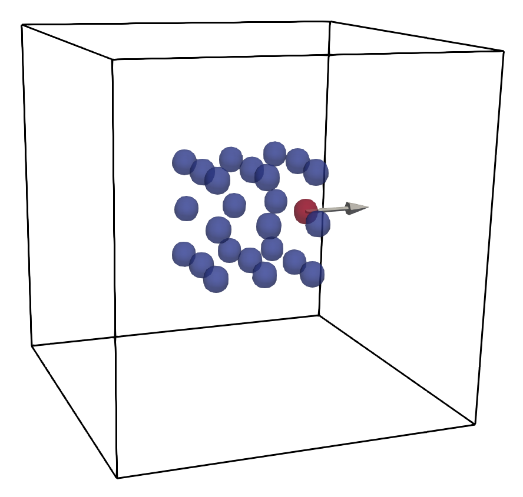

<p align="left">
 
</p>

Simulation using dynamics from a pytorch model with X^{n+1} = A(X^n,V^n,F^n).

To run the simulation for the python mlmod package, use 

```python run_sim_dynamics1.py```

To generate the PyTorch models, use 

```python gen_mlmod_dynamics1.py```

