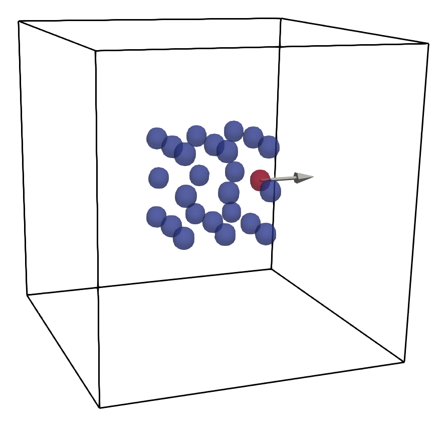

<p align="left">
 
</p>

# ✴️ Modeling Dynamics with PyTorch 

Perform simulations using dynamics from a PyTorch model $A(\cdot;\theta)$ with 
$$X^{n+1} = A(X^n,V^n,F^n;\theta).$$
The model $A$ can be obtained either from training or directly specfied.

## 🔸 Example:

Steps

1. Generate the PyTorch models using

```bash
python gen_mlmod_dynamics1.py
```

2. Run the simulations in the python mlmod package using

```bash
python run_sim_dynamics1.py
```

🔺 This generates a PyTorch model using tracing which is then incorporated into the simulations in place of the LAMMPs time-step integrator.

---