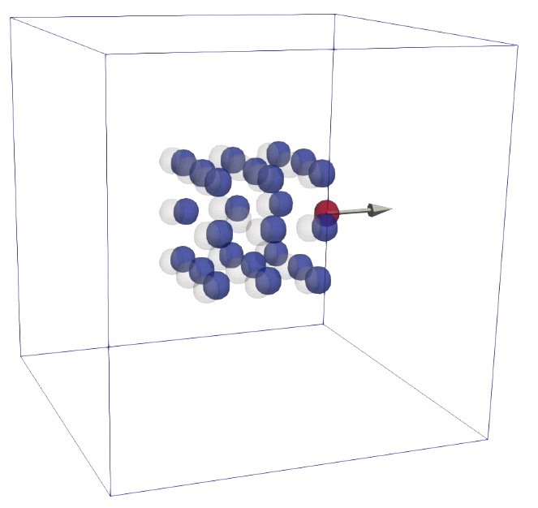

<p align="left">
 
</p>

Simulation of particles that have mobility tensor coupling that is based on
pytorch models for M(X).

----
To run the simulation for the python mlmod package use 

```python run_mlmod_sim1.py```

To generate the PyTorch model use 

```python gen_mlmod_model1.py```

----
To run the simulation using the lammps executable "lmp" for mlmod use 
the script

```
cd mlmod_model1 
lmp -in Model_lmp.LAMMPS_script
```
----

For more information see \
<http://atzberger.org>
