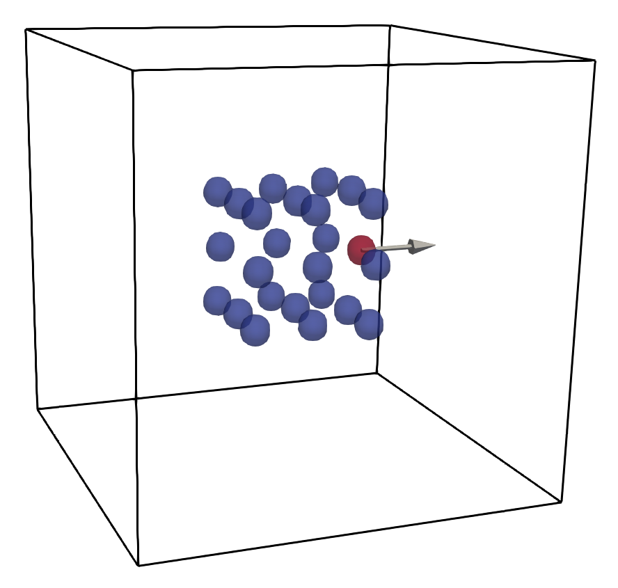

<p align="left">
 
</p>

Simulation using quantity-of-interest from a pytorch model $A(\cdot;\theta)$ with $A(X,V,F,I_T,t;\theta)$.

To run the simulation for the python mlmod package, use 

```python run_sim_qoi1.py```

To generate the PyTorch models, use 

```python gen_mlmod_qoi1.py```

